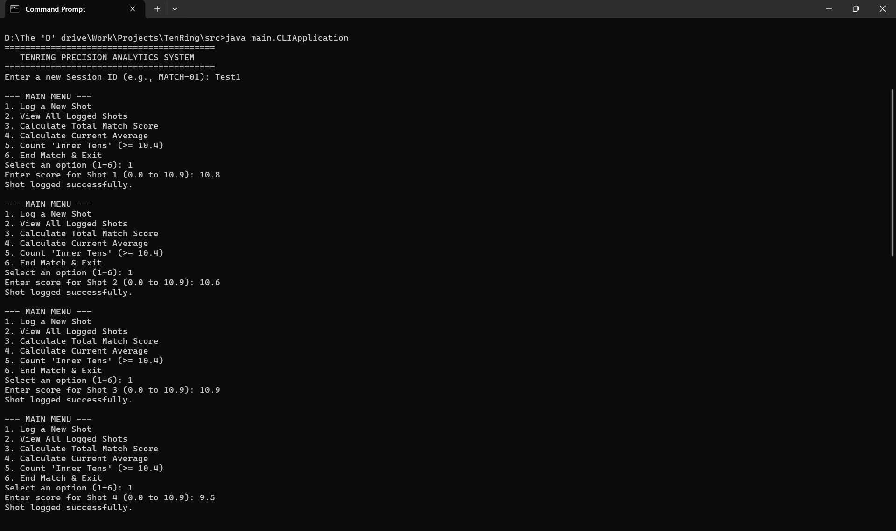
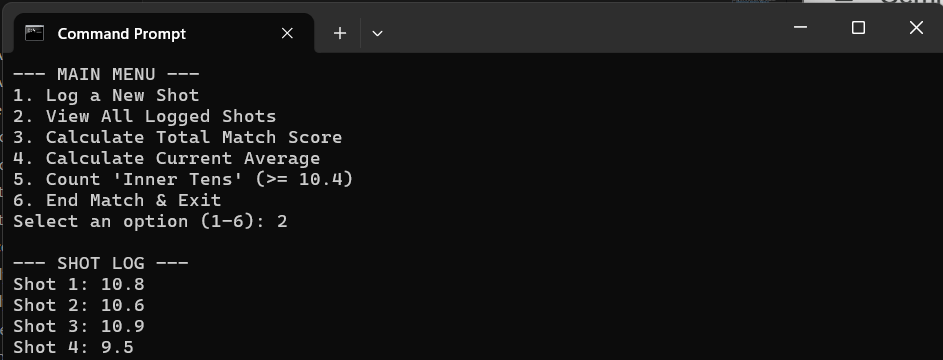
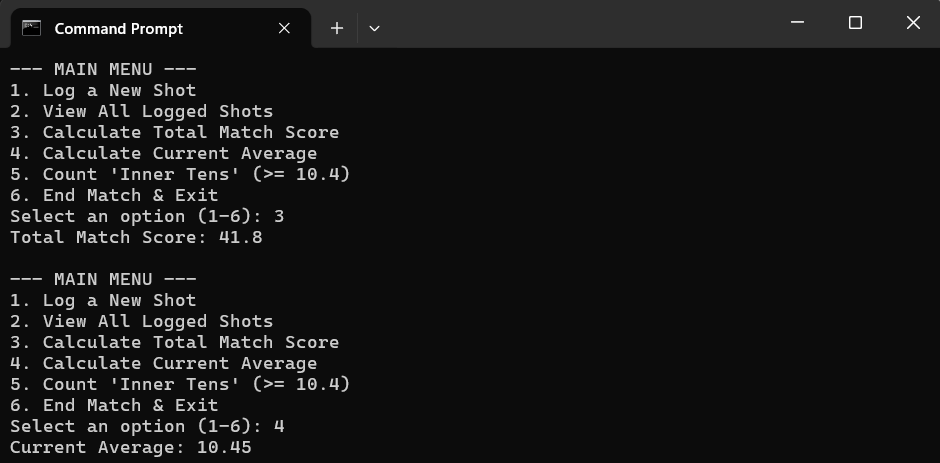
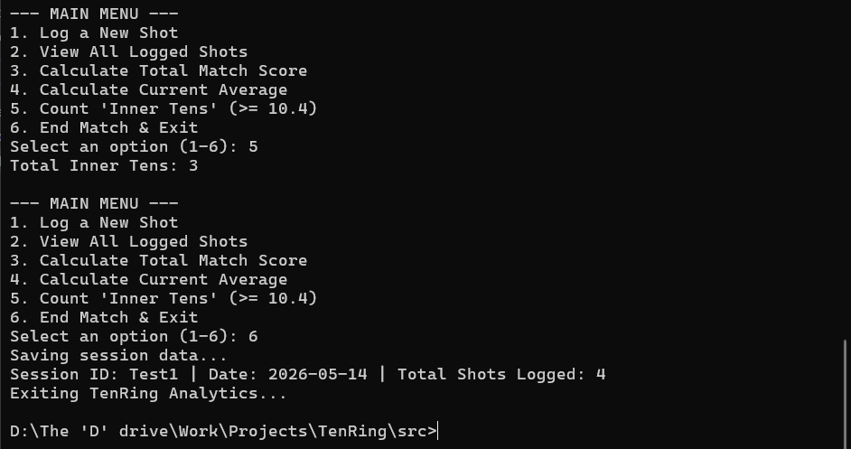
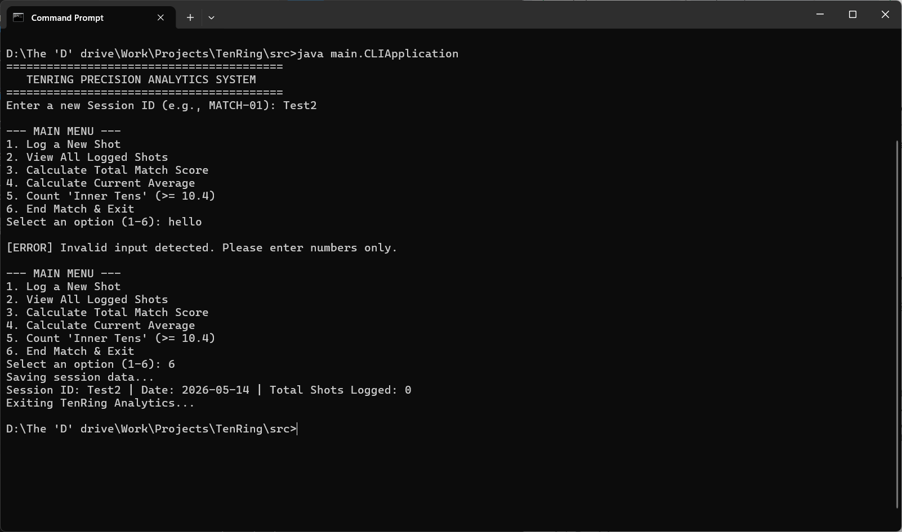

# TenRing: Precision Marksmanship Analytics System 🎯

A console-based Java application designed to track, manage, and analyze performance data for 10m Air Rifle precision marksmanship. Replacing standard data entry with statistical analysis, this system calculates decimal scoring averages and identifies peak performance metrics.

Designed as a fast, offline command-line tool demonstrating core Object-Oriented Programming (OOP) and modern Java concepts.

---

## Features

- **Session Management:** Log individual match sessions with unique IDs.
- **Precision Logging:** Strict decimal scoring (0.0 to 10.9) with input validation.
- **Statistical Analytics Engine:** Calculates total score, current average, and identifies "Inner Tens" (>= 10.4).
- **Robust Exception Handling:** Catches invalid user inputs to prevent application crashes.
- **Interactive CLI:** Menu-driven interface for real-time tracking.

---

## Usage Interface

TenRing runs via a lightweight, robust terminal interface. 







```text
=========================================
   TENRING PRECISION ANALYTICS SYSTEM    
=========================================
Enter a new Session ID (e.g., MATCH-01): PreReq

--- MAIN MENU ---
1. Log a New Shot
2. View All Logged Shots
3. Calculate Total Match Score
4. Calculate Current Average
5. Count 'Inner Tens' (>= 10.4)
6. End Match & Exit
Select an option (1-6): 1
Enter score for Shot 1 (0.0 to 10.9): 10.5
Shot logged successfully.

--- MAIN MENU ---
1. Log a New Shot
2. View All Logged Shots
3. Calculate Total Match Score
4. Calculate Current Average
5. Count 'Inner Tens' (>= 10.4)
6. End Match & Exit
Select an option (1-6): 1
Enter score for Shot 2 (0.0 to 10.9): 10.1
Shot logged successfully.

--- MAIN MENU ---
1. Log a New Shot
2. View All Logged Shots
3. Calculate Total Match Score
4. Calculate Current Average
5. Count 'Inner Tens' (>= 10.4)
6. End Match & Exit
Select an option (1-6): 1
Enter score for Shot 3 (0.0 to 10.9): 10.6
Shot logged successfully.

--- MAIN MENU ---
1. Log a New Shot
2. View All Logged Shots
3. Calculate Total Match Score
4. Calculate Current Average
5. Count 'Inner Tens' (>= 10.4)
6. End Match & Exit
Select an option (1-6): 1
Enter score for Shot 4 (0.0 to 10.9): 9.5
Shot logged successfully.

--- MAIN MENU ---
1. Log a New Shot
2. View All Logged Shots
3. Calculate Total Match Score
4. Calculate Current Average
5. Count 'Inner Tens' (>= 10.4)
6. End Match & Exit
Select an option (1-6): 1
Enter score for Shot 5 (0.0 to 10.9): 10.2
Shot logged successfully.

--- MAIN MENU ---
1. Log a New Shot
2. View All Logged Shots
3. Calculate Total Match Score
4. Calculate Current Average
5. Count 'Inner Tens' (>= 10.4)
6. End Match & Exit
Select an option (1-6): 2

--- SHOT LOG ---
Shot 1: 10.5
Shot 2: 10.1
Shot 3: 10.6
Shot 4: 9.5
Shot 5: 10.2

--- MAIN MENU ---
1. Log a New Shot
2. View All Logged Shots
3. Calculate Total Match Score
4. Calculate Current Average
5. Count 'Inner Tens' (>= 10.4)
6. End Match & Exit
Select an option (1-6): 3
Total Match Score: 50.9

--- MAIN MENU ---
1. Log a New Shot
2. View All Logged Shots
3. Calculate Total Match Score
4. Calculate Current Average
5. Count 'Inner Tens' (>= 10.4)
6. End Match & Exit
Select an option (1-6): 4
Current Average: 10.18

--- MAIN MENU ---
1. Log a New Shot
2. View All Logged Shots
3. Calculate Total Match Score
4. Calculate Current Average
5. Count 'Inner Tens' (>= 10.4)
6. End Match & Exit
Select an option (1-6): 5
Total Inner Tens: 2

--- MAIN MENU ---
1. Log a New Shot
2. View All Logged Shots
3. Calculate Total Match Score
4. Calculate Current Average
5. Count 'Inner Tens' (>= 10.4)
6. End Match & Exit
Select an option (1-6): 6
Saving session data...
Session ID: PreReq | Date: 2026-05-14 | Total Shots Logged: 5
Exiting TenRing Analytics.
```

---

## Controls
The system is navigated via standard numerical keyboard inputs:
Key         Action
1           Prompt to enter decimal score for a new shot
2           Display all previously logged shots in the session
3           Calculate total cumulative score
4           Calculate current decimal average
5           Count shots scoring 10.4 or higher
6           Save session summary and exit

---

## Technologies Used
- Java (JDK 8+)
- Java Collections Framework (ArrayList)
- Java 8 Streams API (For analytics calculations)
- Scanner Class (For user input management)

## System Architecture
```text
Data Layer
[models/Shot.java, models/MatchSession.java]
      ↓
Business Logic Layer
[services/AnalyticsEngine.java]
      ↓
Presentation Layer
[main/CLIApplication.java]
```

---

## Installation and Execution

### Prerequisites
- Java Development Kit (JDK 8 or higher) installed.

### Clone Repository
```bash 
git clone <your-repo-link>
cd TenRing
```
### Compile Application
```bash
cd src
javac models/*.java services/*.java main/CLIApplication.java
```

### Run Application
```bash
java main.CLIApplication
```

---

## Future Improvements

- MySQL database integration for persistent session storage.
- Exporting match data to CSV format.
- Multi-session comparison logic.
- Tracking metrics for different stances or equipment profiles.